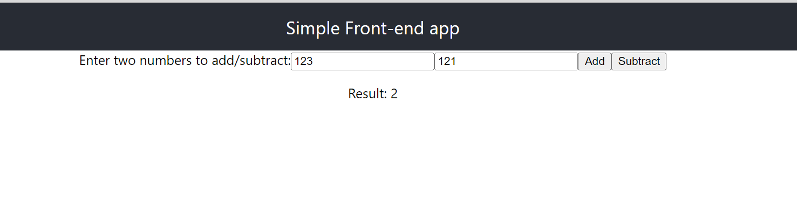
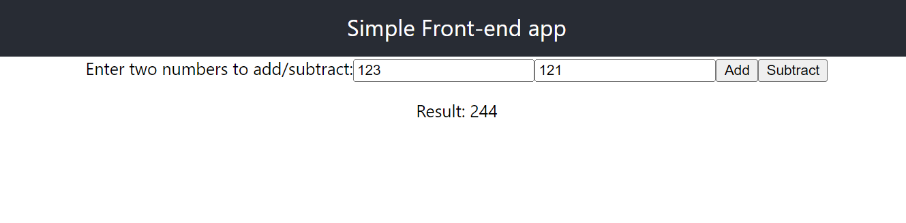
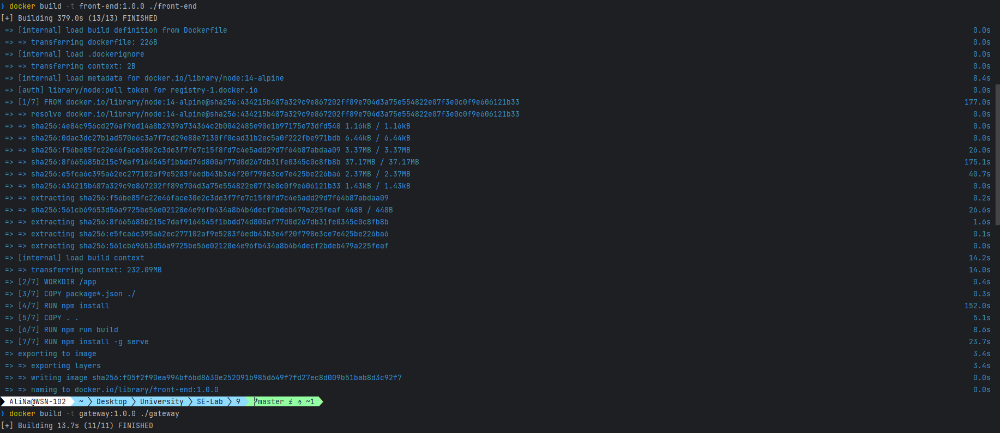
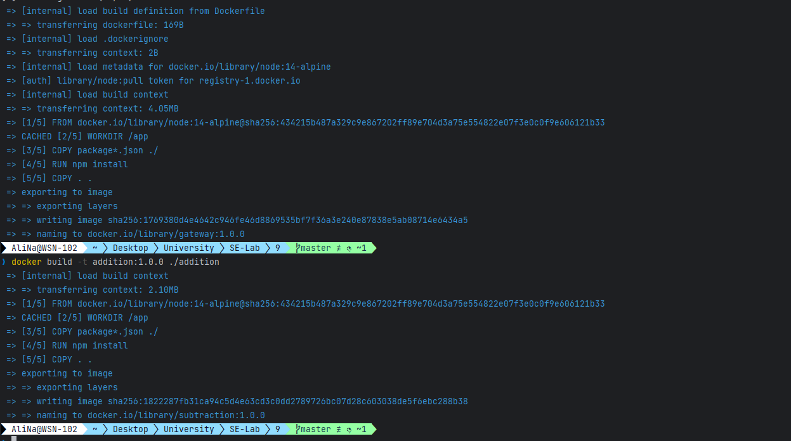
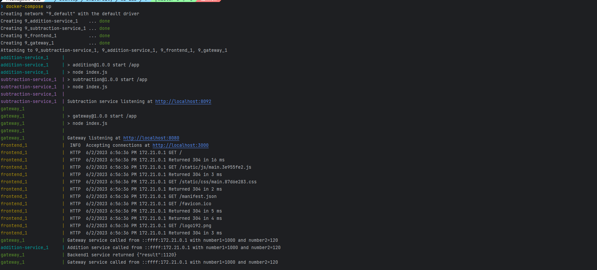

# <p style="text-align: center;">Sharif University of Technology</br>Department of Computer Engineering</br>Software Engineering Lab</p>

## Students Info:

### Ali Najibi, 98106123 </br>Alireza Honarvar, 98102551

## General Info:
In this project, we want to explore and create a simple microservice and deploy it on docker.
The next step of this experiment could be to incorporate kubernetes and create a cluster of microservices.

## Architecture
To create a simple microservice, we used the following elements:
- A front-end service that is responsible for receiving requests from the user and sending them to the back-end service.
- A gateway service that is responsible for routing front-end requests to back-end microservices.
- Multiple back-end services each responsible for a specific task.

In this experiment, we will have 1 front-end service, 1 gateway service, and 2 back-end services.

Note that in a real microservice project, the front-end, gateway and back-end services are usually separated and each one is deployed on a different git repository.

## Front-end Service
The front-end service is a simple web application that can serve two functionalities, namely, adding two numbers and subtracting two numbers.
These two functionalities are served through two different microservices on the back-end but the front-end application
is not aware of this separation and will just send its request to the gateway service.
The gateway service has the responsibility of handling the request and sending it to the appropriate back-end service.
 
### Implementation
The front-end service is implemented using React and the following is the steps:
```shell
mkdir "front-end"
cd "front-end"
npx create-react-app .
cd ..
git add .
git commit -m "Add front-end service"
```
There are some unnecessary files that are created by the create-react-app command and we will remove them and 
also complete the implementation of the front-end service.

It will accept two numbers from user, and perform the operation on them and show the result to the user.

## Back-end Services 1 (Addition)
This service is implemented using Node.js and Express.js.

### Implementation
- We will use port 8091 for the addition service.
```shell
mkdir "addition"
cd "addition"
npm init -y
npm install express --save
echo "/node_modules" >> .gitignore
```

## Back-end Services 2 (Subtraction)
This service is implemented using Node.js and Express.js.

### Implementation
- We will use port 8092 for the subtraction service.
```shell
mkdir "subtraction"
cd "subtraction"
npm init -y
npm install express --save
echo "/node_modules" >> .gitignore
```


## Gateway Service
The gateway service is responsible for routing requests from the front-end service to the appropriate back-end service.
The gateway service will be implemented using Node.js and Express.js.

### Implementation
- We will use port 8080 for the gateway service.
```shell
mkdir "gateway"
cd "gateway"
npm init -y
npm install express --save
npm install axios --save
echo "/node_modules" >> .gitignore
```

Now, let's test these services without docker to make sure everything is working fine.
First, we need to run the back-end services:
```shell
cd "addition"
node index.js
```
```shell
cd "subtraction"
node index.js
```
Now, we can run the gateway service:
```shell
cd "gateway"
node index.js
```
Now, we can open the front-end service in the browser and test it.



Now, to be able to follow and track the logs, we will add some logs to the back-end services, and the gateway.

## Docker
In this step, we will write docker files for all 4 services, and lastly, a docker-compose file to run all of them together.


Now that we have added all the docker files, we will build the image for them:
```shell
docker build -t front-end:1.0.0 ./front-end
docker build -t gateway:1.0.0 ./gateway
docker build -t addition:1.0.0 ./addition
docker build -t subtraction:1.0.0 ./subtraction
```



Now, to test it, since microservices are mostly deployed together, we will use docker-compose to run all of them together:
After running the docker compose and testing the application, we can see from the logs that the 
gateway can not connect to back-end services with the error "ERRCONNREFUSED". This is because docker puts each service in a separate network, so, instead of localhost, we should use "host.docker.internal" in the code of gateway.
We will use environment variable for this matter:
- add this line to 'gateway/index.js'
```js
const base = process.env.BACKEND_BASE || 'http://localhost';

const additionServiceUrl = `${base}:8091/api`
const subtractionServiceUrl = `${base}:8092/api`
```

- add this to docker-compose file:
```yaml
    environment:
      - BACKEND_BASE=http://host.docker.internal
```

Now, you can see the result:
```shell
❯ docker-compose up
Creating network "9_default" with the default driver
Creating 9_addition-service_1    ... done
Creating 9_subtraction-service_1 ... done
Creating 9_frontend_1            ... done
Creating 9_gateway_1             ... done
Attaching to 9_subtraction-service_1, 9_addition-service_1, 9_frontend_1, 9_gateway_1
addition-service_1     |
addition-service_1     | > addition@1.0.0 start /app
addition-service_1     | > node index.js
addition-service_1     |
addition-service_1     | Addition service listening at http://localhost:8091
subtraction-service_1  |
subtraction-service_1  | > subtraction@1.0.0 start /app
subtraction-service_1  | > node index.js
subtraction-service_1  |
subtraction-service_1  | Subtraction service listening at http://localhost:8092
gateway_1              | 
gateway_1              | > gateway@1.0.0 start /app
gateway_1              | > node index.js
gateway_1              |
gateway_1              | Gateway listening at http://localhost:8080
frontend_1             |  INFO  Accepting connections at http://localhost:3000
frontend_1             |  HTTP  6/2/2023 6:56:36 PM 172.21.0.1 GET /
frontend_1             |  HTTP  6/2/2023 6:56:36 PM 172.21.0.1 Returned 304 in 16 ms
frontend_1             |  HTTP  6/2/2023 6:56:36 PM 172.21.0.1 GET /static/js/main.3e955fe2.js
frontend_1             |  HTTP  6/2/2023 6:56:36 PM 172.21.0.1 Returned 304 in 3 ms
frontend_1             |  HTTP  6/2/2023 6:56:36 PM 172.21.0.1 GET /static/css/main.87d6e283.css
frontend_1             |  HTTP  6/2/2023 6:56:36 PM 172.21.0.1 Returned 304 in 2 ms
frontend_1             |  HTTP  6/2/2023 6:56:36 PM 172.21.0.1 GET /manifest.json
frontend_1             |  HTTP  6/2/2023 6:56:36 PM 172.21.0.1 GET /favicon.ico
frontend_1             |  HTTP  6/2/2023 6:56:36 PM 172.21.0.1 Returned 304 in 5 ms
frontend_1             |  HTTP  6/2/2023 6:56:36 PM 172.21.0.1 Returned 304 in 4 ms
frontend_1             |  HTTP  6/2/2023 6:56:36 PM 172.21.0.1 GET /logo192.png
frontend_1             |  HTTP  6/2/2023 6:56:36 PM 172.21.0.1 Returned 304 in 3 ms
gateway_1              | Gateway service called from ::ffff:172.21.0.1 with number1=1000 and number2=120
addition-service_1     | Addition service called from ::ffff:172.21.0.1 with number1=1000 and number2=120
gateway_1              | Backend1 service returned {"result":1120}
gateway_1              | Gateway service called from ::ffff:172.21.0.1 with number1=1000 and number2=120
subtraction-service_1  | Subtraction service called from ::ffff:172.21.0.1 with number1=1000 and number2=120
gateway_1              | Backend2 service returned {"result":880}
gateway_1              | Gateway service called from ::ffff:172.21.0.1 with number1=100012 and number2=12023
addition-service_1     | Addition service called from ::ffff:172.21.0.1 with number1=100012 and number2=12023
gateway_1              | Backend1 service returned {"result":112035}
gateway_1              | Gateway service called from ::ffff:172.21.0.1 with number1=100012 and number2=12023
subtraction-service_1  | Subtraction service called from ::ffff:172.21.0.1 with number1=100012 and number2=12023
gateway_1              | Backend2 service returned {"result":87989}
```
